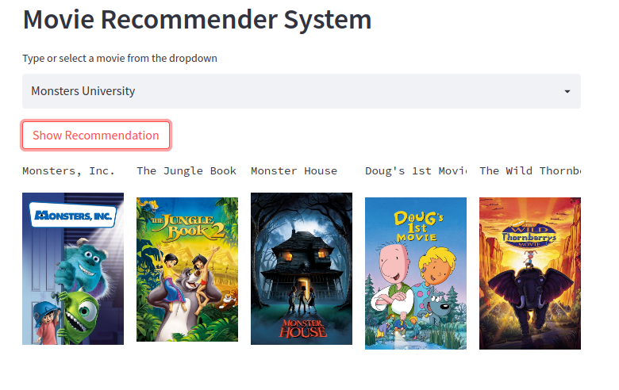
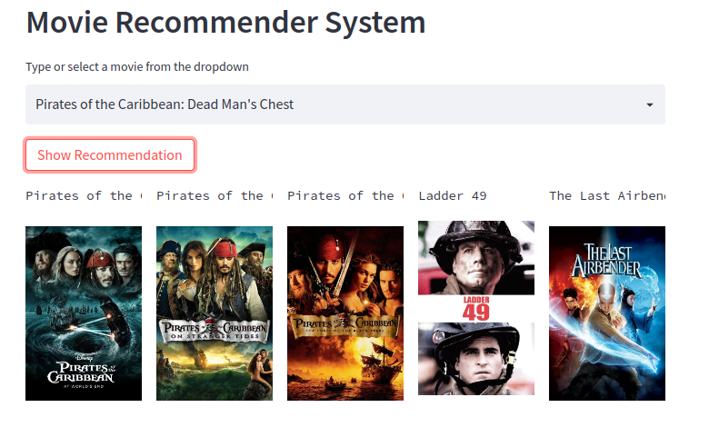
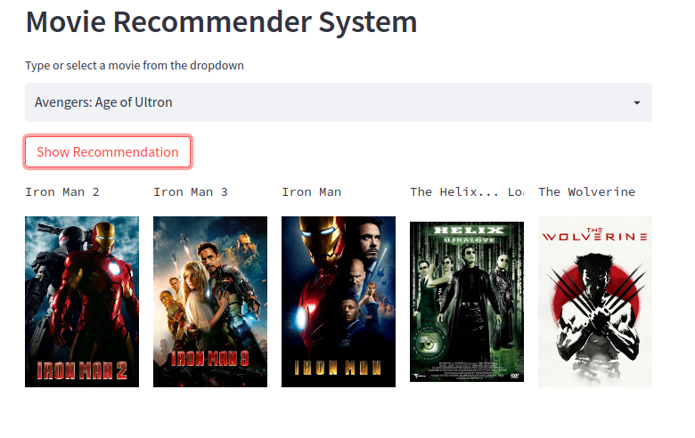

[]
[]

## Authors
[@mzkhan98](https://github.com/mzkhan98)

## Table of Contents

## Business Problem & Intro
Recommendation Systems are a a critical component for many major tech companies such as Spotify and Netflix; since recommended content that is relevent to user can maximise engagement and time spent on the platform.

This project will build a basic content based movie recommender system using cosine similarity. 
[Image](assets/bond.png)

## Data Source 
- [Kaggle TMDB 5000 Movie Data Set](https://www.kaggle.com/datasets/tmdb/tmdb-movie-metadata)

## Methods Used 

- Data Cleaning & Feature Engineering
- Exploratory Data Analysis 
- Text Vectorisation
- Natural Language Processing (Stemming)
- ML model creation 
- WebApp development & deployment on Cloud 

## Tech Stack 
- Python {Pandas, Numpy, Nltk,scikit-learn}
- Streamlit (WebApp development)
- Heroku (Deployment on cloud )

## Project Walk Through
#### Data Cleaning & Feature Engineering

The data is initially in two data sets, one with a list of movies, and the other with casts members. The two data sets are concatenated together, null value and irrelevent features are dropped. From the cast only the first three actors/ actresses are required, and from the crew only the director is needed, therefore OOP functions are coded to return desired features from the dictionaries they are stored in. A new column 'Tags' is created with the overview, cast, crew, and keywords. 

#### Text Vectorisation & Model Building

The 'Tags' need to converted into vectors, each movie will become a vector, so there will be 5000 vectors. This will be achived by using the 'Bag of Words' technique. 

All the words in the tag column will be combined, creating a huge string. The 5000 words that are used most frequently are extracted (W1 representing the most popular word, W5000 the least popular).

The frequency each of the 5000 most popular words occurs in the tags section for each movie (M1 being the first movie, M5000 being the last); thus vector co-ordinates can be given for each movie.

|       | W1 | W2 | W3 | W… | W5000 |
|-------|----|----|----|----|-------|
| M1    |    |    |    |    |       |
| M2    |    |    |    |    |       |
| M3    |    |    |    |    |       |
| M…    |    |    |    |    |       |
| M5000 |    |    |    |    |       |

Stop words (words that do not contribute to the meaning of the sentance) are removed, as well as using the nltk library to do stemming to reduce repeated words (i.e. love, loved, and loving could take up three words, this will reduce the accuracy of the model,using stemming will turn all three variants into a single word:lov).

The model is created using the sci-kit learn library, the cosine distance between each vector is calculated. Cosine distance as opposed to Euclidean distance is used since when dealing with data with large dimensions, Euclidean distance becomes inaccurate. 

Once the distance between all the vectors is calculated, a function is coded to give the 5 closes vectors for a given movie, and return the title of those 5 movies.

#### Streamlit WebApp and Cloud Deployment

WebApp is created using Streamlit. An API is used to fetch posters for the movie recomendations. The App is then deployed on the cloud using Heroku. 

